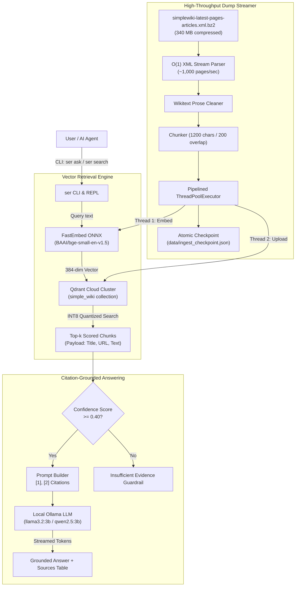

# `ser` — Simple English RAG (Search & Extraction Engine)

[](https://www.python.org/downloads/)
[](https://qdrant.tech/)
[](https://github.com/qdrant/fastembed)
[](https://ollama.ai/)
[](https://github.com/parm2006/SimpleEnglishRag)

`ser` is a local-first, agent-friendly Retrieval-Augmented Generation (RAG) engine and global command-line utility built over the complete Simple English Wikipedia corpus. 

It provides sub-second semantic retrieval across hundreds of thousands of encyclopedic articles using local ONNX embeddings (`BAAI/bge-small-en-v1.5`), managed vector storage on Qdrant Cloud Free Tier with INT8 scalar quantization, and strict citation-grounded generation via local Ollama models (`llama3.2:3b`, `qwen2.5:3b`, etc.).

---

## Architecture Overview



---

## Key Features

- **Blazing Fast Local Embeddings**: Uses `fastembed` with ONNX Runtime on CPU (~30 chunks/sec, 384 dims, zero PyTorch dependency).
- **Free-Tier Optimized Qdrant Cloud**: Configured with INT8 scalar quantization (4x RAM reduction) and on-disk payload storage to fit the entire ~238,000-article Wikipedia corpus within Qdrant Cloud Free Tier (1 GB RAM, 4 GB SSD).
- **Sub-Second Semantic Search**: Instant query response times over hundreds of thousands of passages.
- **Strict Anti-Hallucination Guardrails**: Answers are conditioned *strictly* on retrieved Simple English Wikipedia excerpts with bracketed citations (`[1]`, `[2]`), a low LLM temperature (0.2), and an automatic confidence threshold cut-off.
- **Global AI Agent Tool**: Installed as a system-wide executable (`ser`). AI coding assistants, background agents, and human developers can query it from any terminal or directory.
- **Resilient & Resumable Dump Streaming**: Line-streaming XML parser with atomic JSON checkpointing and exponential backoff retry for network resilience.

---

## Quickstart

### 1. Installation

Clone the repository and install `ser` globally using `uv`:

```bash
git clone https://github.com/parm2006/SimpleEnglishRag.git
cd SimpleEnglishRag

# Install globally as a CLI tool:
uv tool install --editable .

# Or run within virtual environment:
uv sync
```

Verify the installation:
```bash
ser stats
```

### 2. Configuration (`.env`)

Create a `.env` file in the project root:

```env
# Vector Storage Configuration
QDRANT_STORAGE=cloud
QDRANT_COLLECTION=simple_wiki
QDRANT_URL=https://your-cluster-id.cloud.qdrant.io
QDRANT_API_KEY=your_qdrant_cloud_api_key

# Optional: Local Fallback
# QDRANT_STORAGE=local
# QDRANT_LOCAL_PATH=data/qdrant_db

# Generator Configuration (Ollama)
OLLAMA_HOST=http://localhost:11434
OLLAMA_MODEL=llama3.2:3b
CONFIDENCE_THRESHOLD=0.40
```

> **Note**: For answer generation, ensure [Ollama](https://ollama.ai) is running locally (`ollama run llama3.2:3b` or `ollama run qwen2.5:3b`). Pure semantic search (`ser search`) requires no LLM.

---

## CLI Usage Reference

`ser` can be used non-interactively for one-off lookups, or interactively as a full REPL.

### Ask a Question (RAG Answering)
Runs semantic retrieval and generates a cited answer using your local Ollama model:
```bash
ser "What is the theory of relativity?"
# or explicitly:
ser ask "Who was Isaac Newton?"
```

### Pure Semantic Search (No LLM required)
Searches Qdrant Cloud and prints matching chunks, similarity scores, and Wikipedia source URLs:
```bash
ser search "quantum mechanics atomic structure"
```

### Check Database & Cloud Status
Displays current collection metrics, point counts, vector dimension, and quantization mode:
```bash
ser stats
```

### Live Wikipedia Article Ingestion
Crawls an article directly from Simple English Wikipedia via the Action API, chunks it, and indexes it into Qdrant Cloud in real time:
```bash
ser ingest-wiki "Quantum mechanics"
```

### Bulk Wikipedia Dump Ingestion
Streams and indexes articles from the official Wikimedia XML dump (`data/simplewiki-latest-pages-articles.xml.bz2`):

```bash
# Ingest entire corpus (~238,000 articles)
ser ingest-dump all

# Ingest first N articles
ser ingest-dump 1000

# Restart from article #1 (clears existing checkpoint)
ser ingest-dump all --reset
```

### Interactive REPL Mode
Run `ser` with no arguments to enter an interactive session:
```bash
ser
```
Available inside the REPL:
- Any text: Treated as a question
- `/search <query>`: Semantic search
- `/ingest-wiki <title>`: Index a live article
- `/ingest-dump [N]`: Ingest from dump
- `/stats`: Show collection statistics
- `/help`: Show command list
- `/exit`: Exit

---

## Guide for AI Agents & Automation

`ser` is designed to be an ultra-fast knowledge source for autonomous AI agents, coding assistants, and automated scripts.

### Why Use `ser` in Agent Workflows?
- **Concise & Simple English**: Plain language minimizes token usage and avoids convoluted encyclopedic jargon.
- **Zero Local Vector Footprint**: Data lives in Qdrant Cloud; local agents only need network access and FastEmbed ONNX runtime.
- **Zero-Fuss CLI**: Return codes and stdout are structured for automated terminal execution.

### 1. Subshell / Tool Call Invocation

In your agent's bash/terminal tool:
```bash
# To search for factual context:
ser search "artificial intelligence neural network"

# To get a cited, factual answer directly:
ser ask "When was the United Nations founded?"
```

### 2. Python API Integration

AI agents with Python interpreter access can import and invoke the engine directly:

```python
from ser.db import client
from ser.pipeline import ask
from ser.generate import generate_answer

# 1. Retrieve top matching chunks
query = "What is photosynthesis?"
chunks = ask(client, query=query, k=3)

for c in chunks:
    title = c.payload.get("title")
    url = c.payload.get("url")
    score = c.score
    text = c.payload.get("text")
    print(f"[{score:.4f}] {title} ({url}): {text[:100]}...")

# 2. Generate a grounded response (optional, requires Ollama)
answer, citations = generate_answer(query, chunks)
print("\nAnswer:", answer)
print("Citations:", citations)
```

### 3. Chunk Payload Schema

Each point in Qdrant contains the following payload dictionary:

| Field | Type | Description |
|---|---|---|
| `chunk_id` | `str` | Deterministic ID formatted as `{page_id}-{chunk_index}` |
| `doc_id` | `str` | Wikipedia Page ID |
| `title` | `str` | Article title (e.g. `"Photosynthesis"`) |
| `url` | `str` | Canonical Simple Wikipedia URL |
| `chunk_index` | `int` | 0-indexed position within the article |
| `text` | `str` | Chunk text (normalized, ~1,200 characters max) |

Deterministic UUIDs are generated with `uuid.uuid5(uuid.NAMESPACE_DNS, chunk_id)` for idempotent upserts.

---

## Ingestion & Quantization Specs

| Metric | Specification |
|---|---|
| **Dump Source** | `simplewiki-latest-pages-articles.xml.bz2` (339.7 MB compressed) |
| **Total Articles** | ~237,811 pages (ns=0, non-redirect, $\ge 150$ characters) |
| **Embedding Model** | `BAAI/bge-small-en-v1.5` (384 dimensions) |
| **Chunk Size** | 1,200 characters (~200–250 words), 200 character overlap |
| **Quantization** | INT8 Scalar Quantization (0.99 quantile, RAM-cached) |
| **Vector Storage** | `on_disk=True` (SSD storage on Qdrant Cloud) |
| **Payload Storage** | `on_disk=True` (Payload stored on SSD) |
| **RAM Footprint** | ~384 bytes/vector $\rightarrow$ ~150 MB RAM for 250k vectors |
| **Disk Footprint** | ~1.5 KB/chunk $\rightarrow$ ~400–600 MB SSD for entire wiki |
| **Throughput** | ~30 chunks/sec CPU embedding, overlapping cloud upload |

---

## Directory Structure

```
SimpleEnglishRAG/
├── data/
│   ├── simplewiki-latest-pages-articles.xml.bz2  # Compressed Wikimedia dump (340 MB)
│   └── ingest_checkpoint.json                   # Resumable atomic ingestion checkpoint
├── src/
│   └── ser/
│       ├── __init__.py      # Package export
│       ├── chunk.py         # Chunking with boundary snapping & stub filtering
│       ├── cli.py           # Rich CLI, REPL, and command router
│       ├── db.py            # Qdrant client, schema initialization, and retries
│       ├── download.py      # Resumable streaming dump downloader
│       ├── dump.py          # O(1) line-streaming XML parser & wikitext cleaner
│       ├── embed.py         # FastEmbed ONNX embedding runner
│       ├── generate.py      # Ollama generation with citation guardrails
│       ├── ingest.py        # Wikipedia Action API crawler
│       ├── pipeline.py      # Thread-pipelined indexing & search
│       └── points.py        # Micro-batching and deterministic uuid5 point creation
├── pyproject.toml           # Package metadata, dependencies, and CLI entrypoint
├── README.md                # Project documentation
└── AGENTS.md                # Agent-first instructions & API specs
```

---

## License

MIT License. Feel free to use, modify, and integrate into your agents and applications.